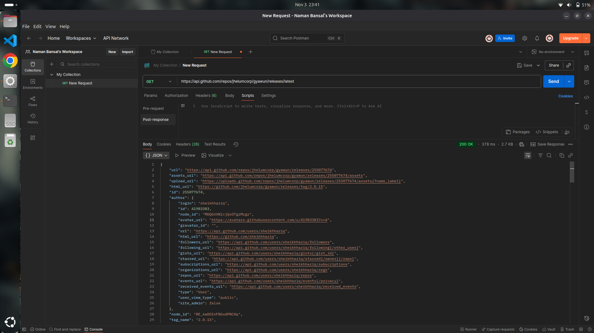
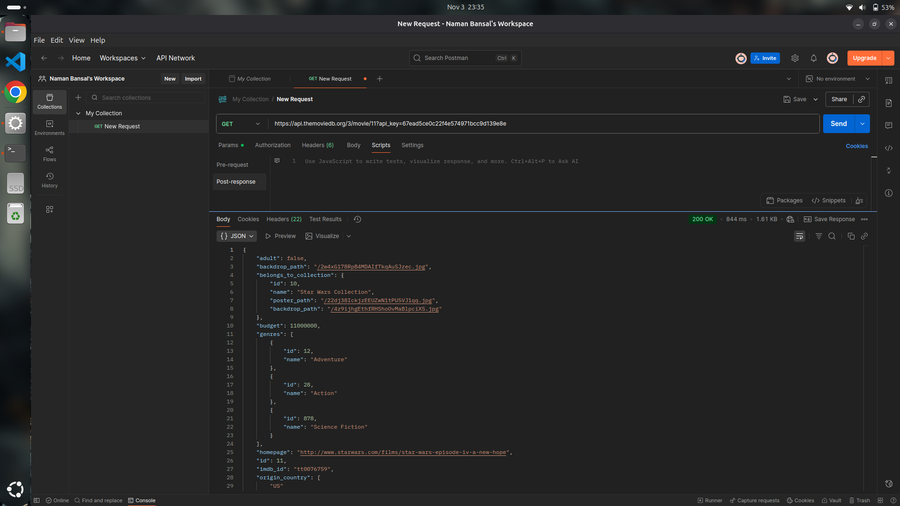
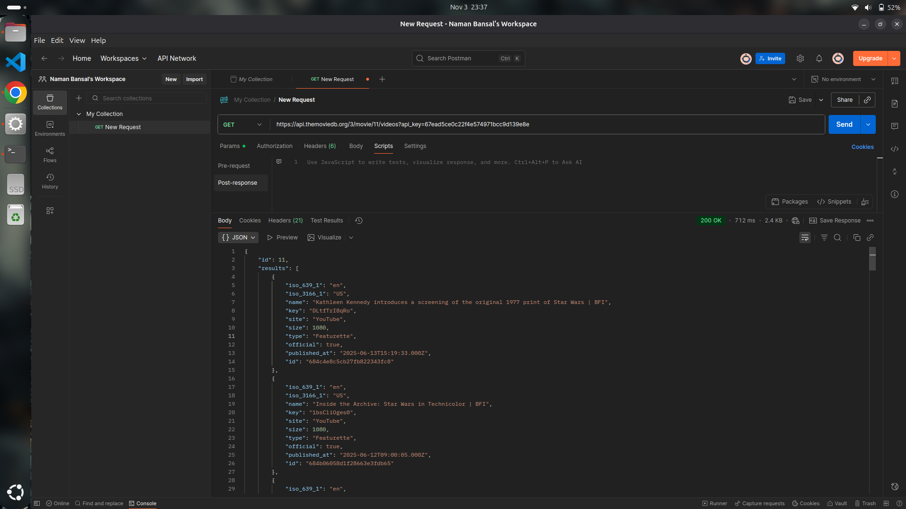
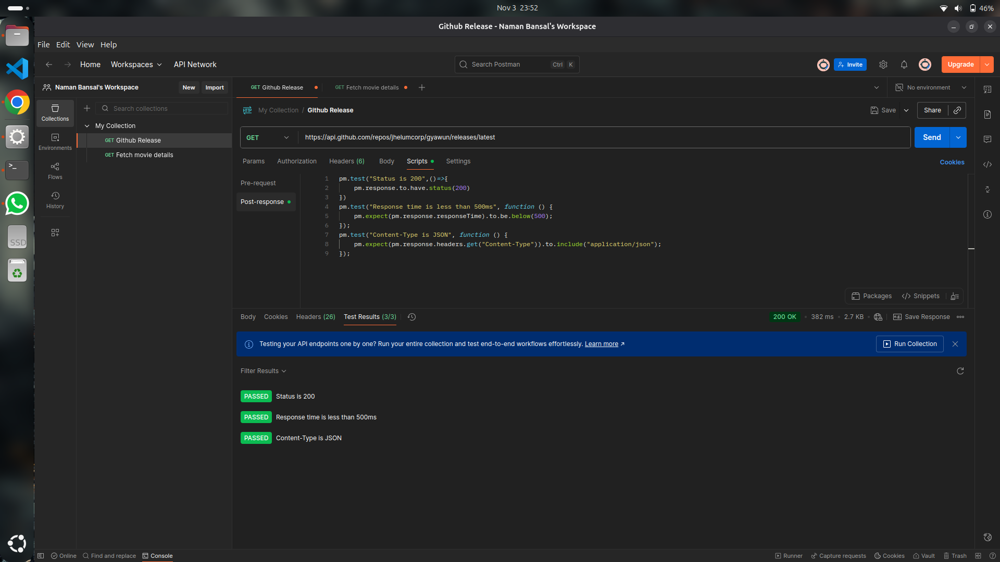
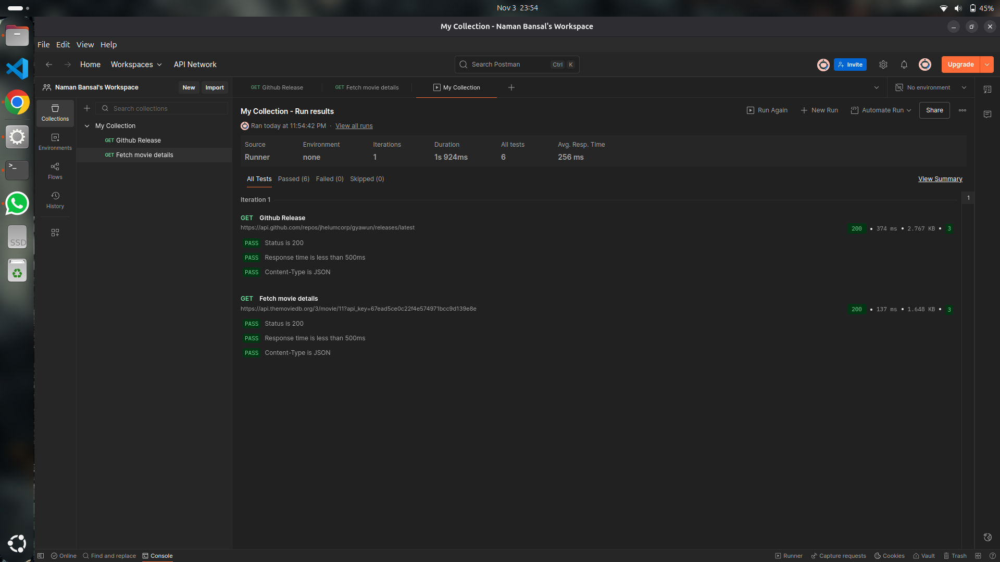

# QA Automation Project: Selenium + Postman API Testing

This project demonstrates both **Web UI Automation using Selenium** and **API Automation using Postman**.

The goal is to simulate real QA engineer responsibilities such as:

* Validating UI flows
* Navigating application pages
* Download interaction testing
* Validating API responses
* Checking JSON data
* Running test collections

---

## 🔹 Selenium Test Scripts

These Selenium scripts perform actions on the live website:

### 1) Download button click & file download flow

* Open web app
* Locate download button
* Click
* Validate download

### 2) Browser navigation test

* Back
* Forward
* Refresh

Below are direct recordings of the automated test executions:

| Scenario | Recording |
|---------|-----------|
| Download Button Test | [Watch Video](./assets/selenium/download_automation.webm) |
| Navigation Test | [Watch Video](./assets/selenium/navigation_automation.webm) |

---

## 🔹 API Testing (Postman)

Below are the screenshots representing different API test flows using Postman.

### 1) GitHub Release API Response

fetched the app release details from github using github api

### 2) TMDB Movie Details API
Fetched movie details using TMDB api.

### 3) TMDB Movie Videos API
Fetched details of movie videos using TMDB api.

### 4) Postman Test Results
Tested api success and response time.

### 5) Collection Runner Executing Automated Tests
Ran all the tests together using collection run.

---

## Tools Used

| Feature        | Tool                   |
| -------------- | ---------------------- |
| UI Automation  | Selenium + Python      |
| API Testing    | Postman                |
| Browser Driver | ChromeDriver           |
| Website Tested | gyawunmusic.vercel.app |

---

## Conclusion

This project showcases end-to-end QA automation skills combining both UI and API testing.

---
